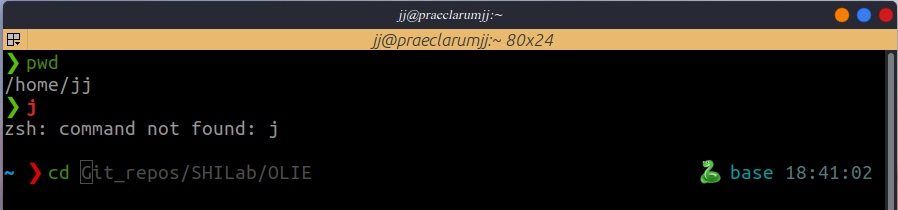
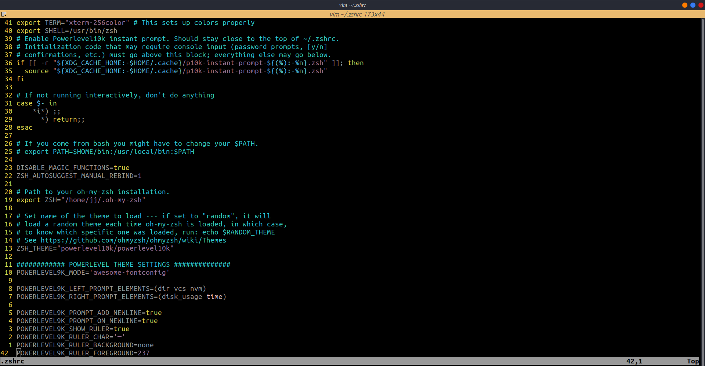

# Shell Config

This repo contains the configuration files for shell setups as used for my device. I don't mention the steps to incorporate them into a system as they are readily available online. The exact setup requires a little effort, so I am sharing the scripts.

## Files

- [.bashrc](https://github.com/praeclarumjj3/Shell-Setup/blob/master/.bashrc): Startup Script for **bash** Shell (I used bash earlier).

- [.zshrc](https://github.com/praeclarumjj3/Shell-Setup/blob/master/.zshrc): Startup Script for **zsh** Shell (Currently in use).

- [.vimrc](https://github.com/praeclarumjj3/Shell-Setup/blob/master/.vimrc): Startup Script for **vim** Editor.

- [.p10k.zsh](https://github.com/praeclarumjj3/Shell-Setup/blob/master/.p10k.zsh): File for the **zsh theme**. I use the [Powerlevel10k](https://github.com/romkatv/powerlevel10k) theme for my **zsh**.

## Visuals

- **Terminal with ZShell**

- **Vim Editor**

